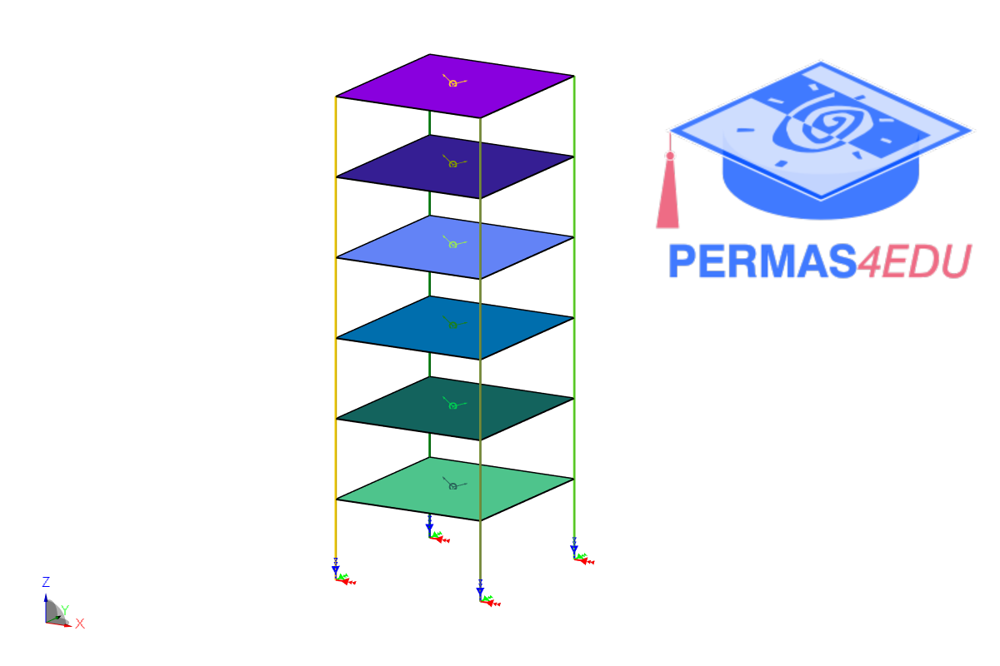

The example is adapted from [Bayesian FFT modal identification for multi-setup experimental modal analysis](https://doi.org/10.1016/j.ymssp.2025.112931)
Thanks to Binbin Li and Peixiang Wang for private communication.

