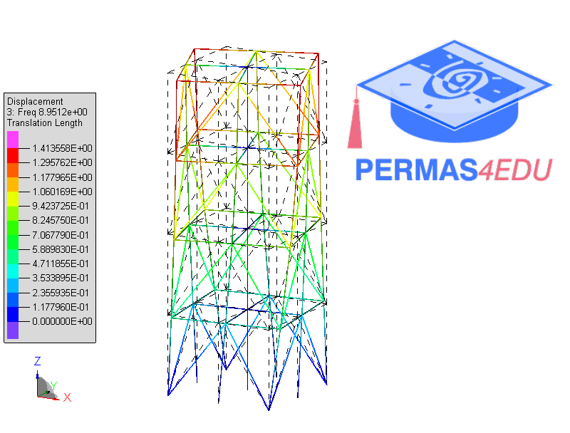

***
[⬅️](../077/README.md "Previous example")
[➡️](../079/README.md "Next example")
***

The example is adapted from [A hybrid data-physics framework with conformal GNN for enhanced damage identification](https://doi.org/10.1016/j.aei.2025.103718)

