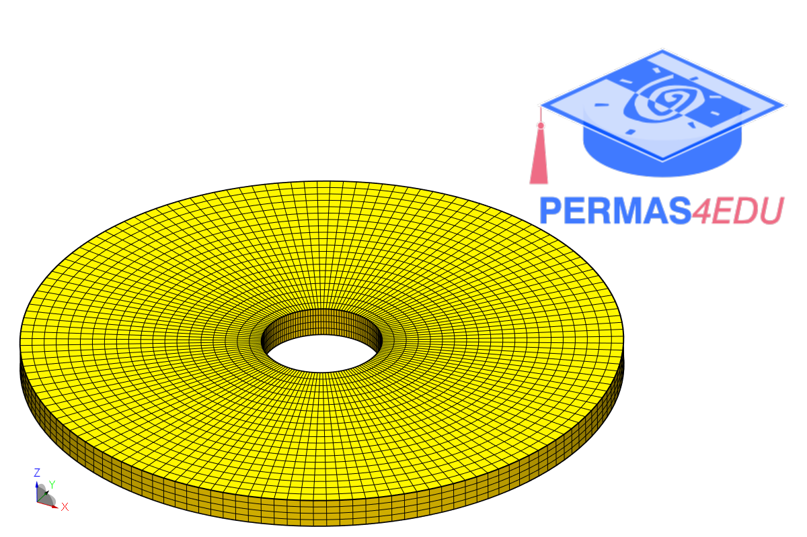

***
[⬅️](../079/README.md "Previous example")
[➡️](../081/README.md "Next example")
***

The example is adapated from [Modal Analysis of a High-Speed Train Gearbox Housing Using Smoothed Finite Element Method](https://doi.org/10.1142/S0219876223500378)

