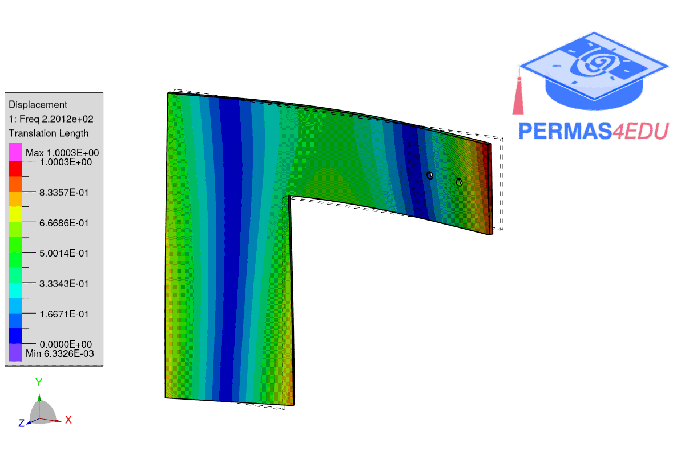

***
[⬅️](../082/README.md "Previous example")
[➡️](../README.md "Go up one directory level")
***

The examples are adapted from [Machine learning algorithm for rivet-squeezing force estimation based on the dynamic response of the joint](https://doi.org/10.1016/j.ymssp.2025.113478)
Thanks to Tim Vrtač and Gregor Čepon for providing CAD models of the substructures A and B, as well as of assemblies ARB and ARB'. Their support is greatly appreciated. 

