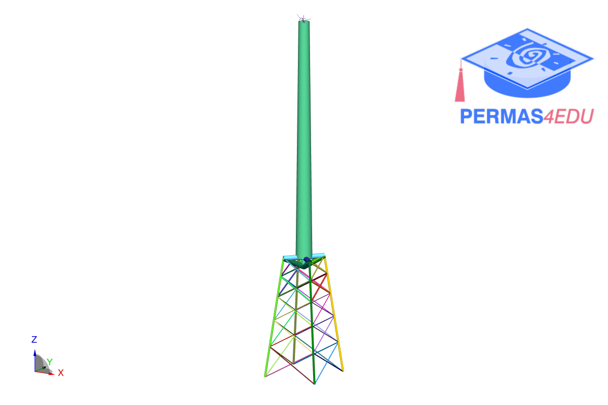
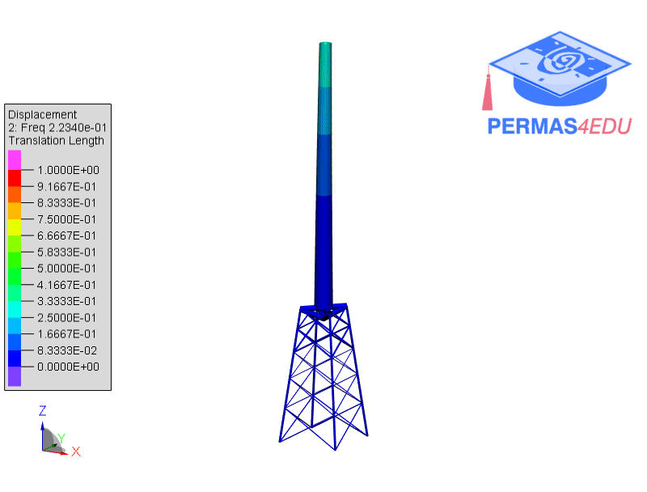
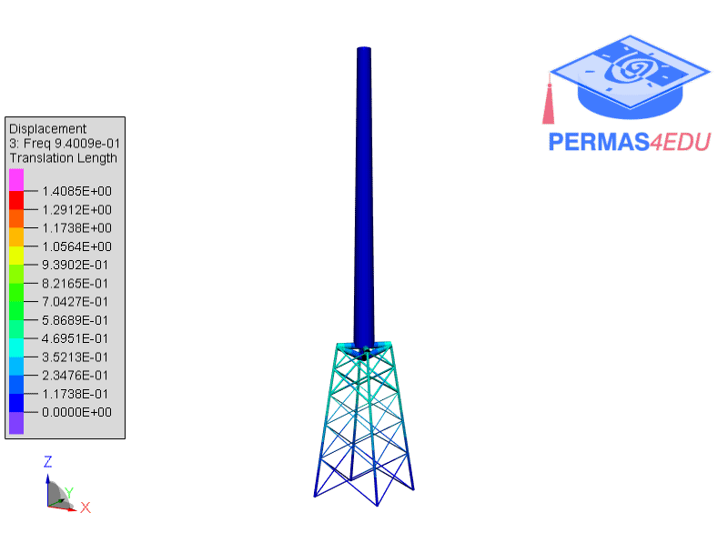
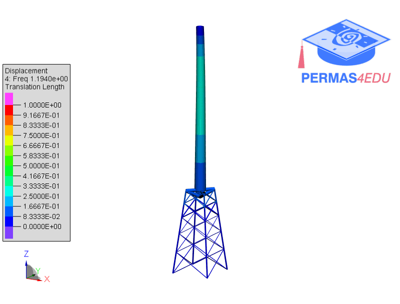

***
[⬅️](../083/README.md "Previous example")
[➡️](../README.md "Go up one directory level")
***

The example is adapted from [Importance of the soil–structure interaction in the optimisation of the jacket designs of offshore wind turbines](https://doi.org/10.1016/j.oceaneng.2024.117802)

Thanks to Román Quevedo Reina for sharing information about the underlying finite element model of the jacket structure. His support is greatly appreciated.

