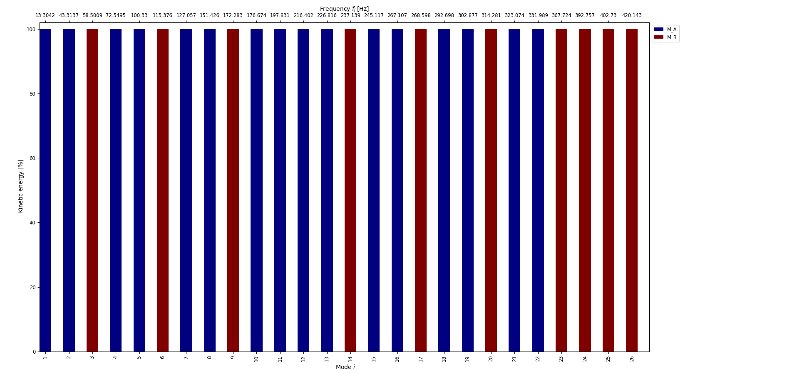

***
[⬅️](../085/README.md "Previous example")
[➡️](../README.md "Go up one directory level")
***

The example is adapted from [An analytical calculation method for whole workspace position-dependent natural frequencies and mode shapes of machine tool](https://doi.org/10.1016/j.ymssp.2025.113650)

