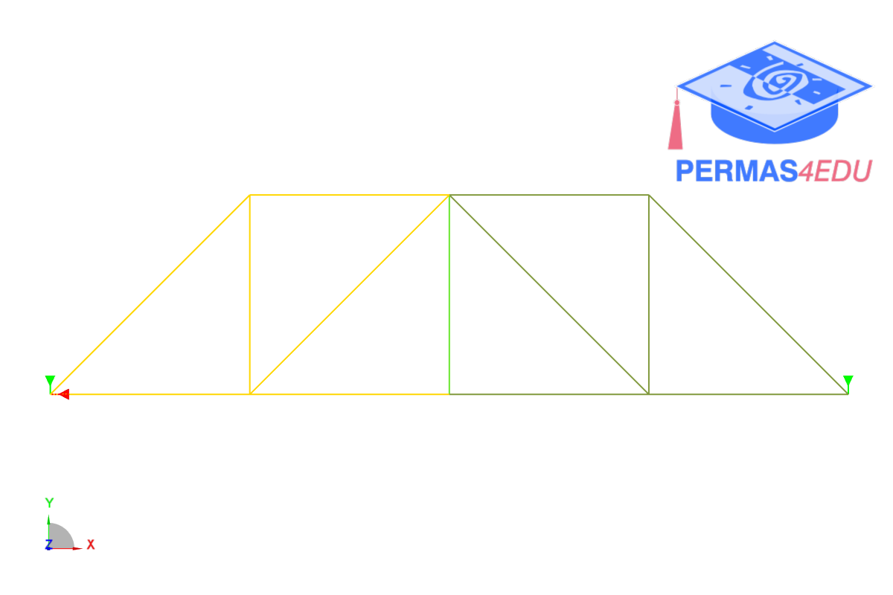
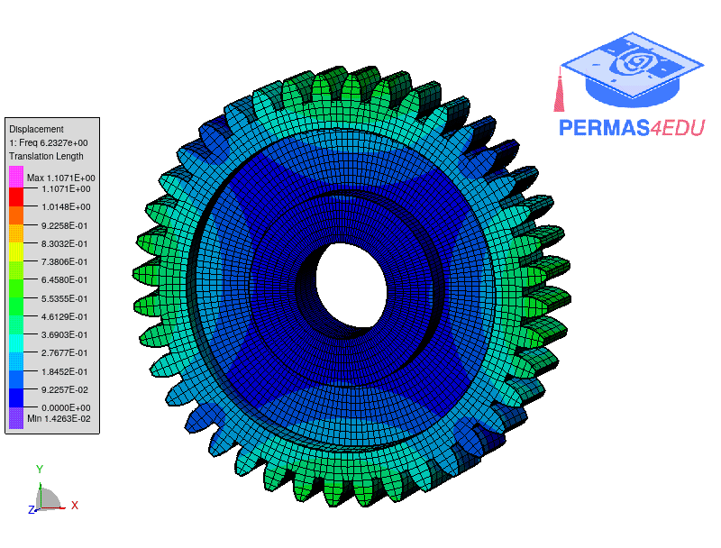

***
[⬅️](../086/README.md "Previous example")
[➡️](../088/README.md "Next example")
***

The examples are adapted from [An iterative dual Craig-Bampton method](https://doi.org/10.1016/j.ymssp.2025.113563)
Thanks to Faizan Baqir for private communication and sharing a baseline model of the gear.

### Truss example

### Cylinder example

### Gear 

