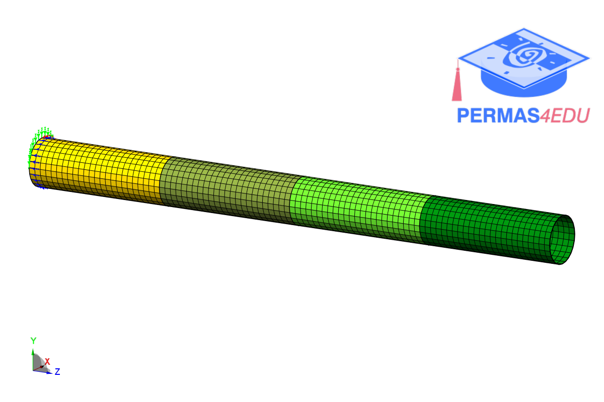

***
[⬅️](../086/README.md "Previous example")
[➡️](../README.md "Go up one directory level")
***

The examples are adapted from [An iterative dual Craig-Bampton method](https://doi.org/10.1016/j.ymssp.2025.113563)
Thanks to Faizan Baqir for private communication.

### Cylinder example

