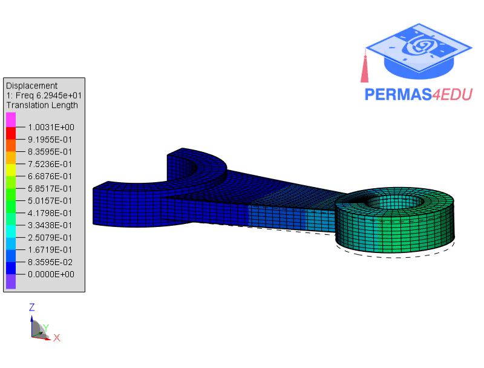
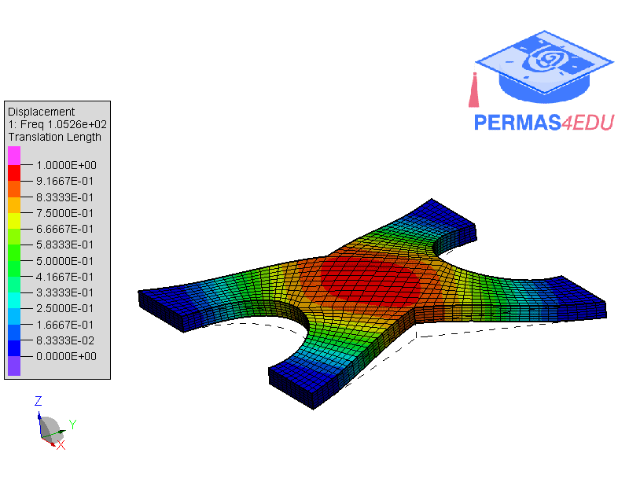

***
[⬅️](../088/README.md "Previous example")
[➡️](../090/README.md "Next example")
***

The example is adapted from [Simultaneous multi-objective optimization of tri-directional graded material and porosity distributions for multi-patch structures using adaptive isogeometric analysis and Nitsche’s method](https://doi.org/10.1016/j.cma.2026.118758)

