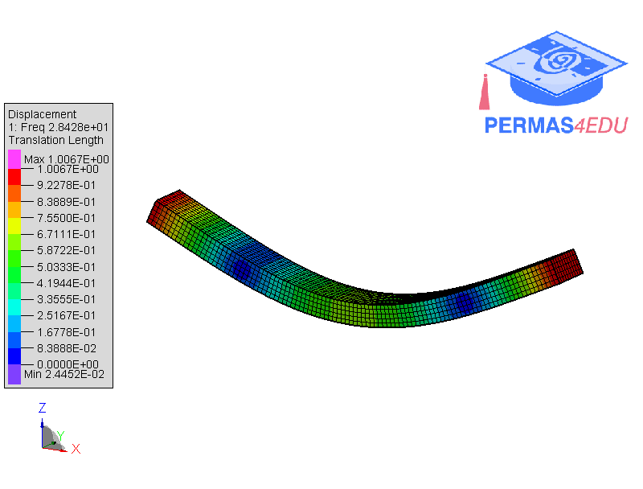
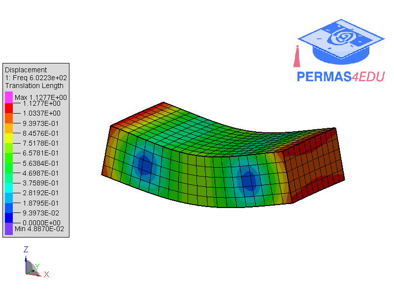

***
[⬅️](../089/README.md "Previous example")
[➡️](../091/README.md "Next example")
***

The example is adapted from [Semi-analytical solution of VABS-based Timoshenko Beam Model for free vibration of composite structures](https://doi.org/10.1016/j.ijsolstr.2026.113852)

