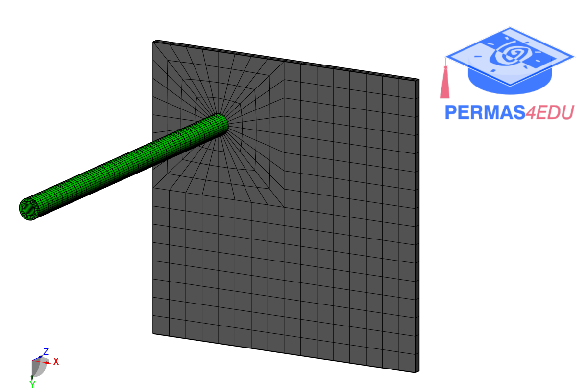

***
[⬅️](../091/README.md "Previous example")
[➡️](../093/README.md "Next example")
***

The example is adapted from [On the Axial-Bending-Torsional Vibration Coupling Effect Occurring in a Cantilever Beam with an Asymmetrically Attached Spatial Rigid Body](https://doi.org/10.1007/s42417-025-02302-w)

