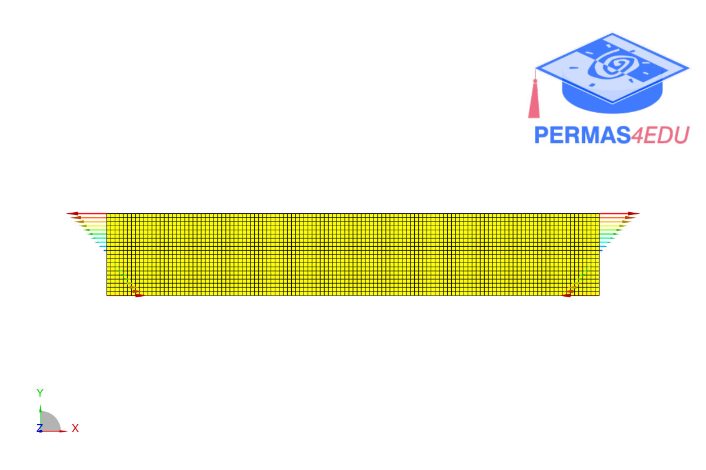
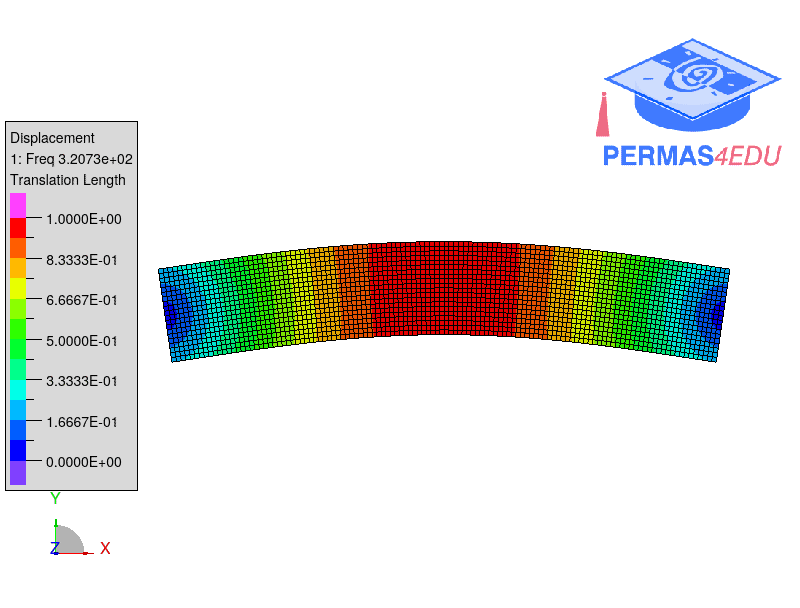

***
[⬅️](../094/README.md "Previous example")
[➡️](../096/README.md "Next example")
***

The example is adapted from [Higher-order transmissibility and its linear approximation for in-service crack identification in train wheelset axles](https://doi.org/10.1016/j.ymssp.2026.114089)

### Static analysis

### Modal analysis

