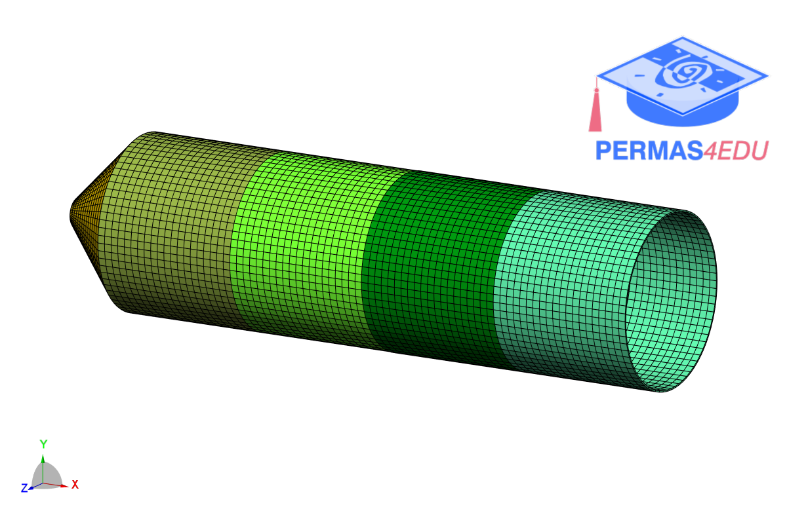

***
[⬅️](../095/README.md "Previous example")
[➡️](../097/README.md "Next example")
***

The example is adapted from [Semi-Analytical Modeling and Free Vibration Analysis of Joined Conical–Cylindrical Shells with Axially Stepped Thickness](https://doi.org/10.3390/vibration9010013)

