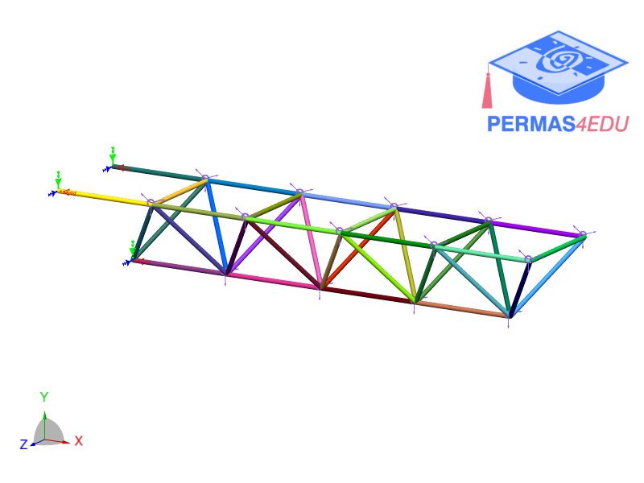

***
[⬅️](../096/README.md "Previous example")
[➡️](../098/README.md "Next example")
***

The example is adapted from [Sparse Bayesian Optimization with a Sequential Coordinate Search for Structural Finite Element Model Updating Using Uncertain Modal Data](https://doi.org/10.1016/j.swevo.2026.102360)

