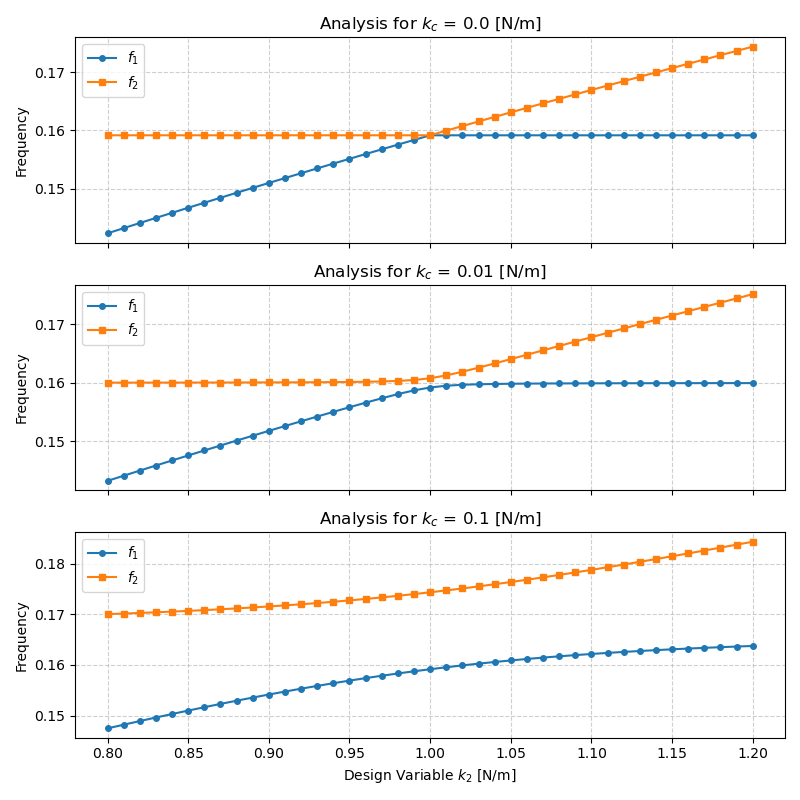

***
[⬅️](../097/README.md "Previous example")
[➡️](../README.md "Go up one directory level")
***

The example is adapted from [Graph-based surrogate modeling for structural eigenvalue problems with modal matching training](https://doi.org/10.1007/s00366-026-02310-8)

