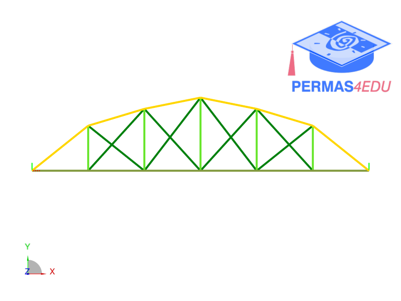
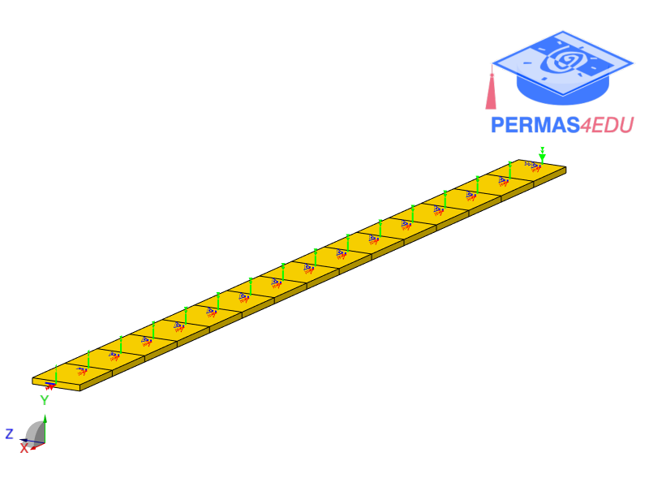

***
[⬅️](../098/README.md "Previous example")
[➡️](../README.md "Go up one directory level")
***

The examples are adapted from [Simulation-based method for probabilistic damage detection and quantification using modal measurements](https://doi.org/10.1016/j.istruc.2026.111527)

### Truss bridge

### Cantilever beam

