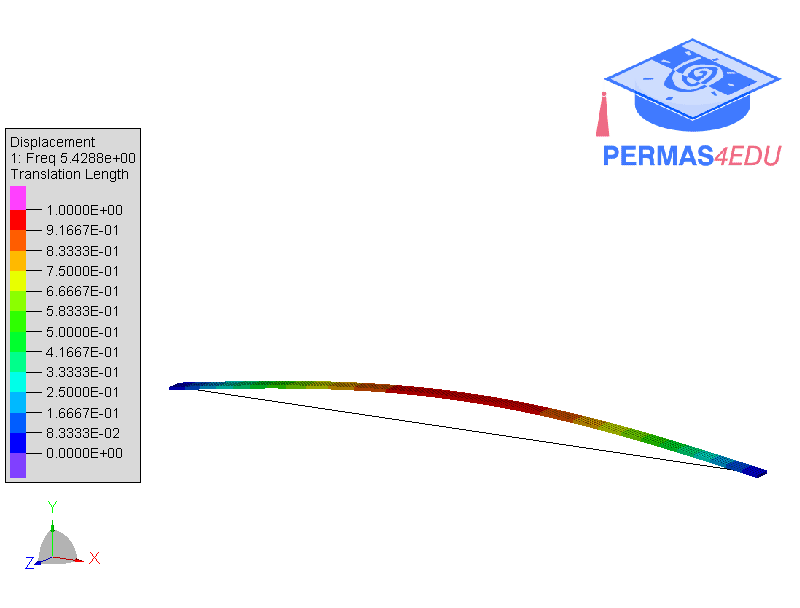

***
[⬅️](../102/README.md "Previous example")
[➡️](../104/README.md "Next example")
***

The example is adapted from [Bay-Fi: Approximate Bayesian main Frequency Identification for extremely undersampled signals](https://doi.org/10.1016/j.ymssp.2026.114339)

