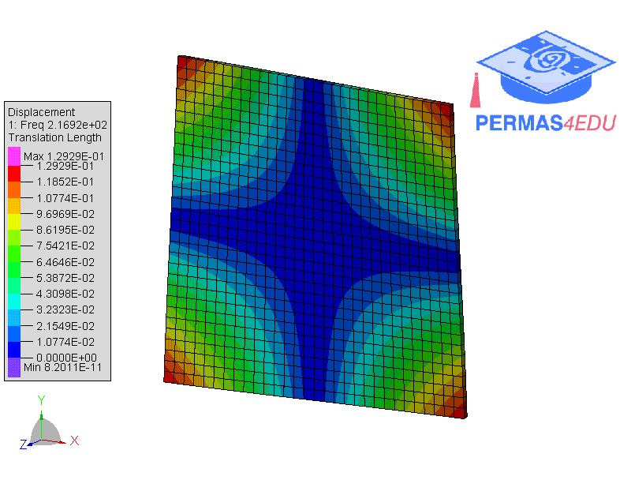

***
[⬅️](../103/README.md "Previous example")
[➡️](../105/README.md "Next example")
***

The example is adapted from [𝑂(𝑛) Local Eigenvalue Modification Procedure for real-time updating of structural digital twins with sub-millisecond-latency performance](https://doi.org/10.1016/j.ymssp.2026.114451)

