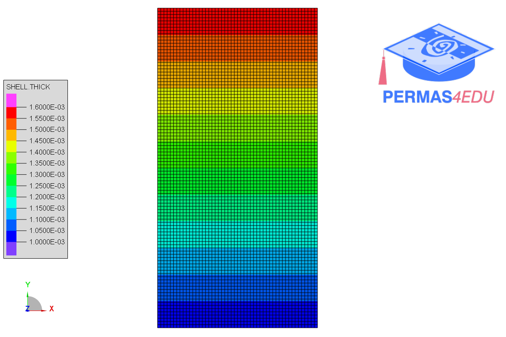

***
[⬅️](../105/README.md "Previous example")
[➡️](../107/README.md "Next example")
***

The example is adapted from [Extended analytical strip method for free vibration analysis of rectangular thin plates with arbitrarily varying parameters along one edge](https://doi.org/10.1177/10775463261453834)

