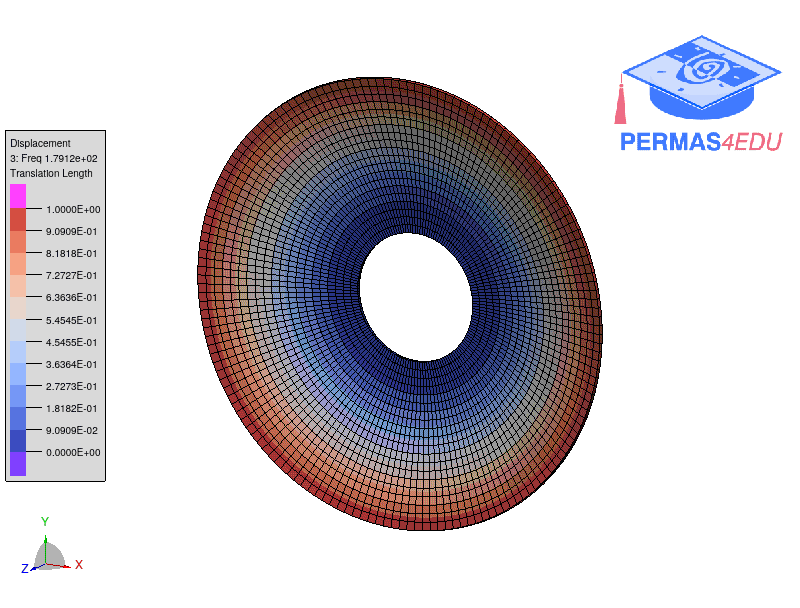
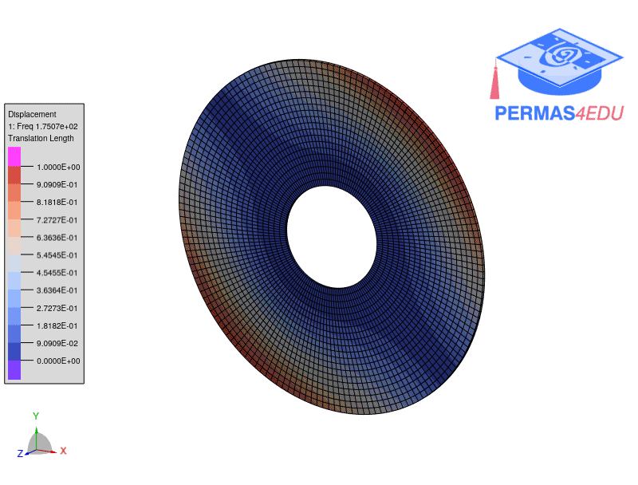
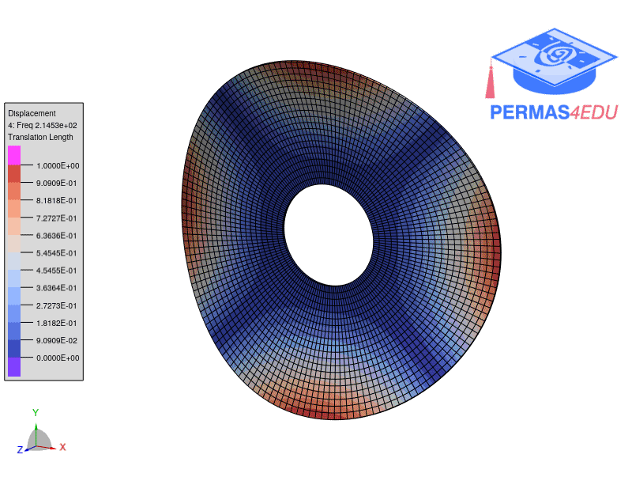
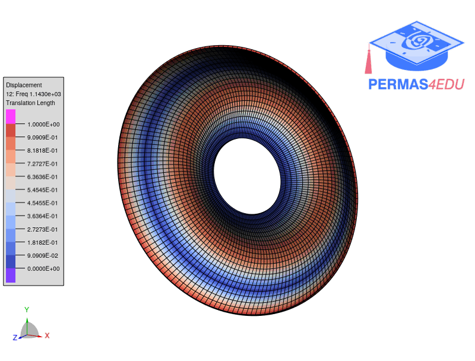
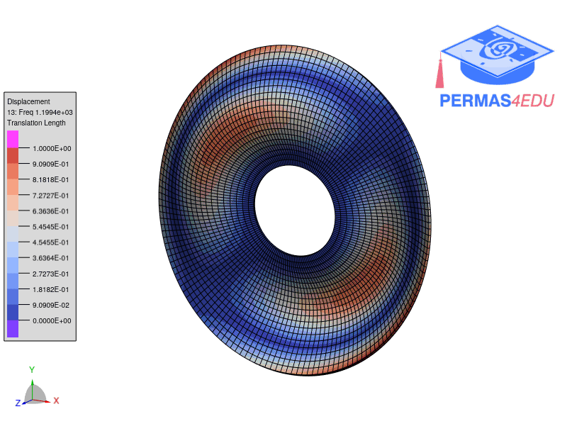
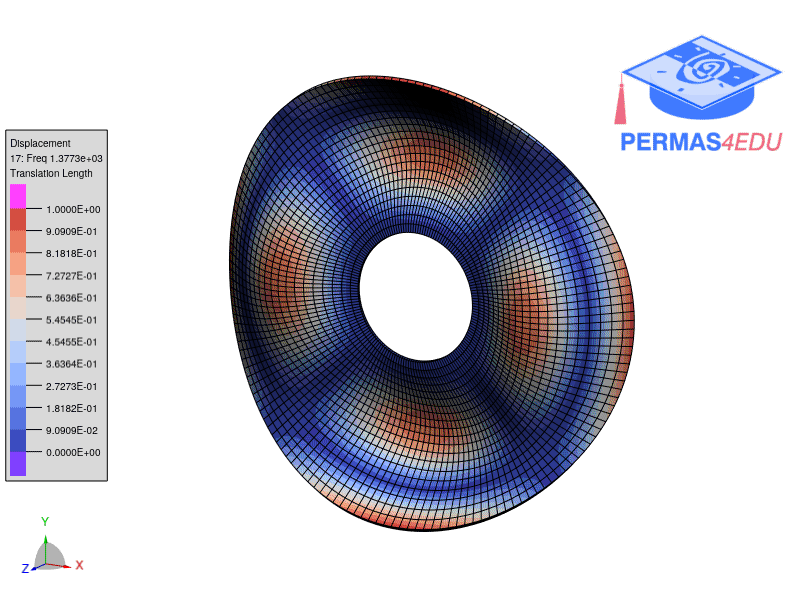
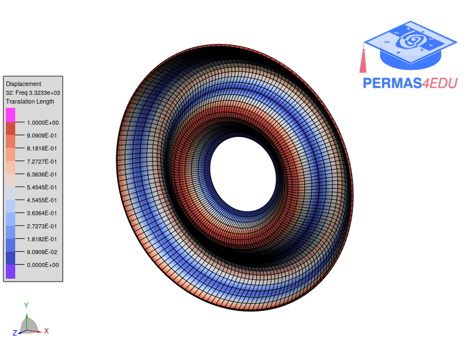
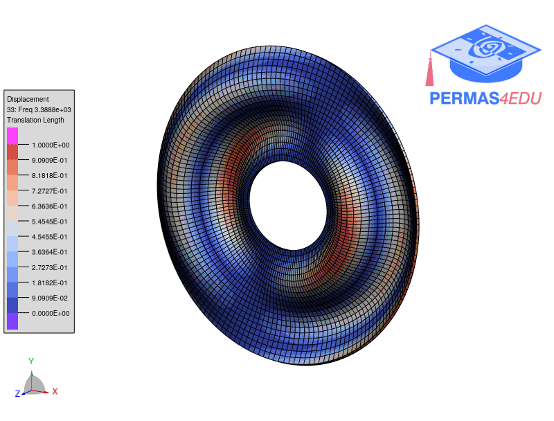
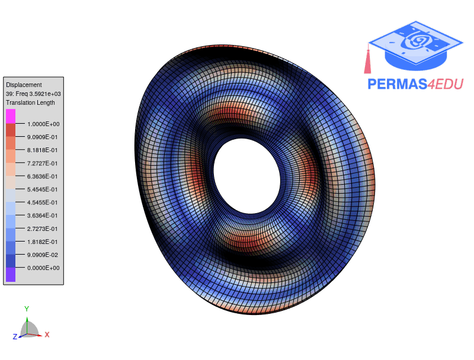

***
[⬅️](../106/README.md "Previous example")
[➡️](../README.md "Go up one directory level")
***

The example is adapted from [DYNAMIC BEHAVIOR OF CIRCULAR AND ANNULAR PLATES: ANALYTICAL MODELING AND EXPERIMENTAL MODAL VALIDATION](https://doi.org/10.1016/j.tws.2026.115230)

