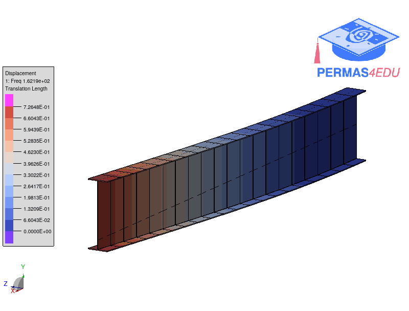
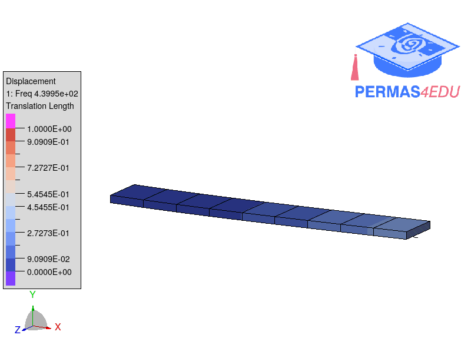

***
[⬅️](../107/README.md "Previous example")
[➡️](../README.md "Go up one directory level")
***

The example is adapted from [Certified Eigenfrequency Bounds for Euler–Bernoulli and Timoshenko Cantilever Beams with Tip Mass, Rotary Inertia, and a Rotational Spring](https://doi.org/10.1007/s42417-026-02507-7). Thanks to Giovanni Volpatti for private communication.

### Case A

### Case C

