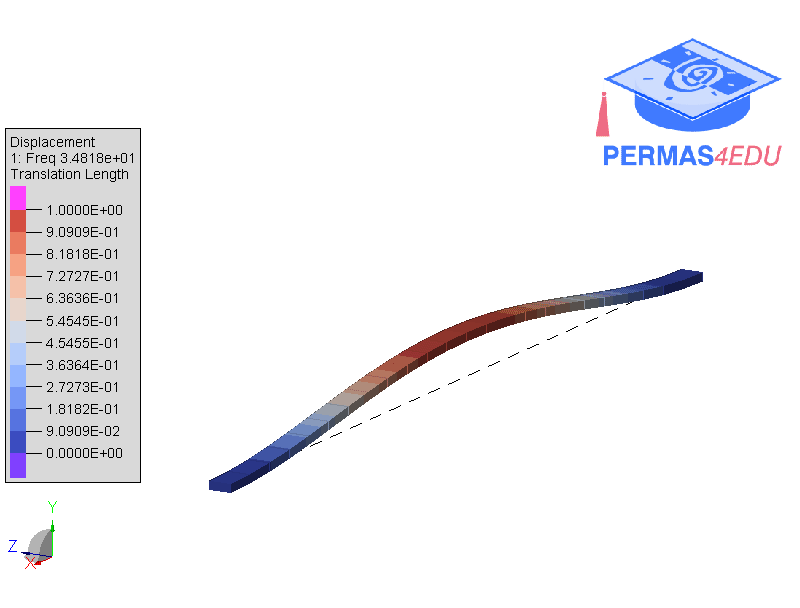

The example is adapted from [Experimental strain modal analysis for beam-like structure by using distributed fiber optics and its damage detection](https://iopscience.iop.org/article/10.1088/1361-6501/aa6c8c)

