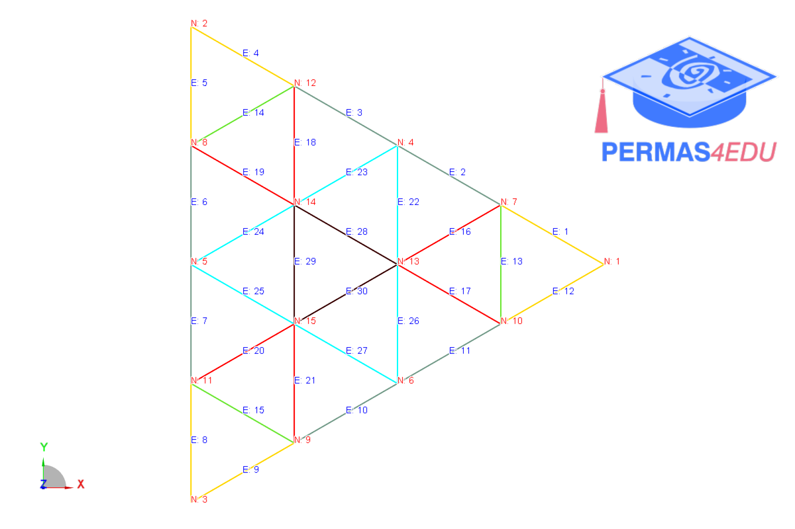
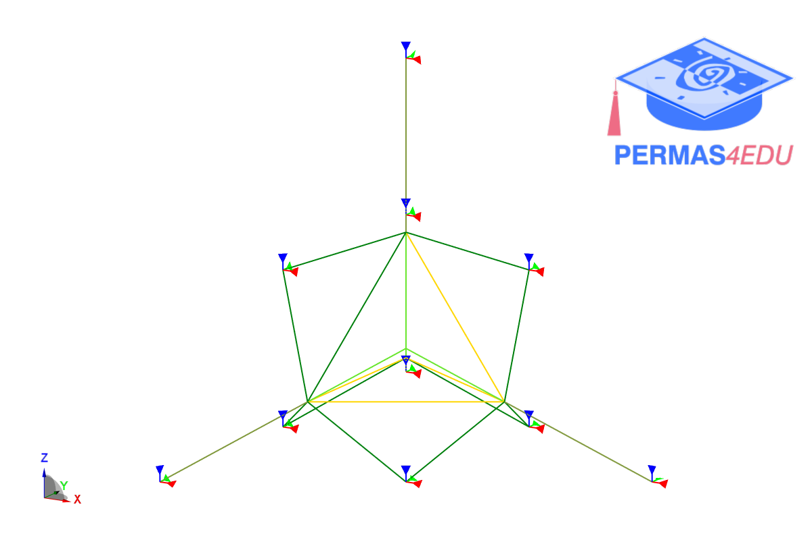
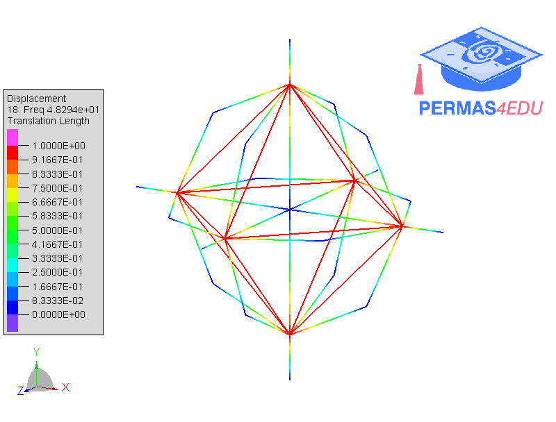

***
[⬅️](../109/README.md "Previous example")
[➡️](../README.md "Go up one directory level")
***
The examples are adapted from [Structural symmetry and differentiability of multiple eigenvalues](https://doi.org/10.1016/j.compstruc.2026.108339)

## Planar grid truss

## Tetrahedral truss

## Octahedral truss

