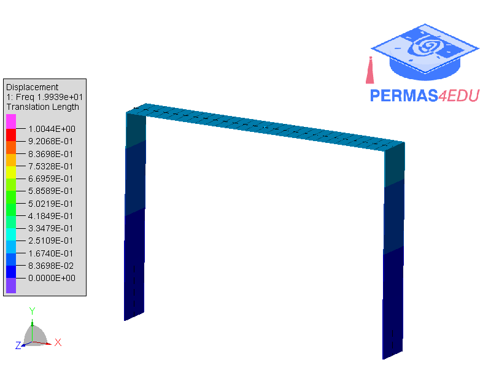
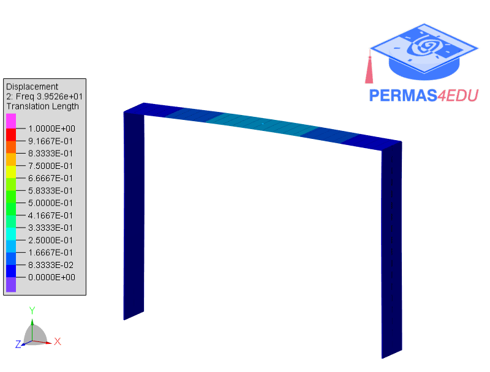

***
[⬅️](../111/README.md "Previous example")
[➡️](../README.md "Go up one directory level")
***

The example is adapted from [Nonlinear dynamics near internal resonance in a beam-based resonator with spatially separated modal motions](https://doi.org/10.1016/j.ijnonlinmec.2026.105412)

