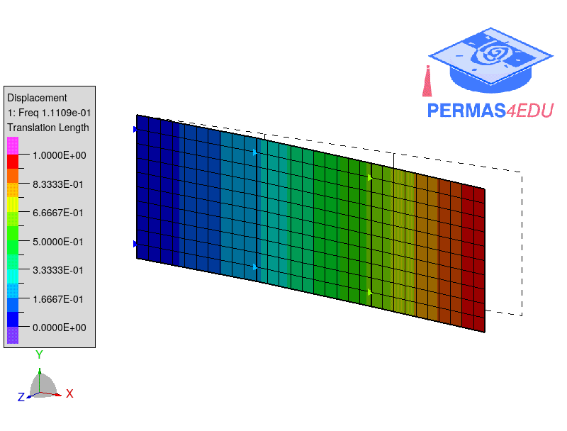
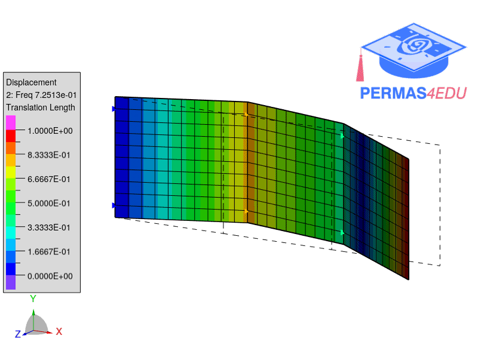
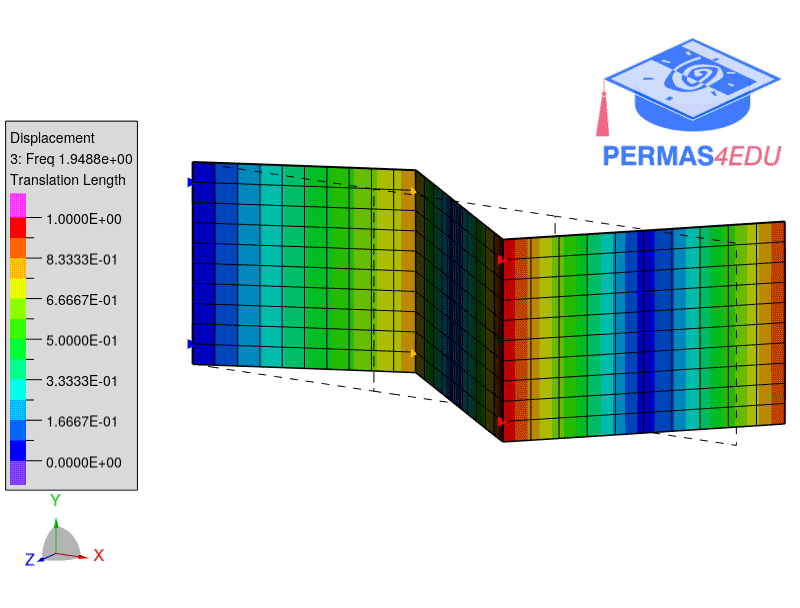
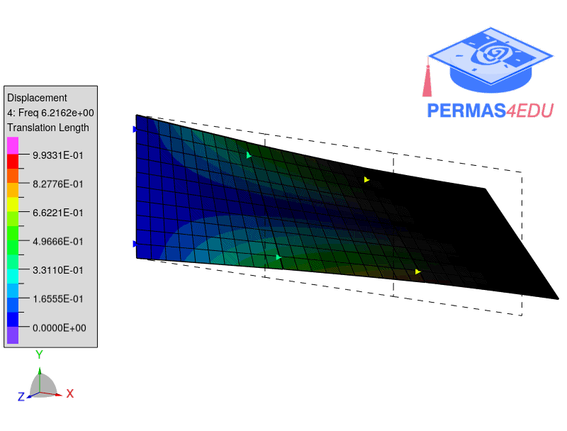
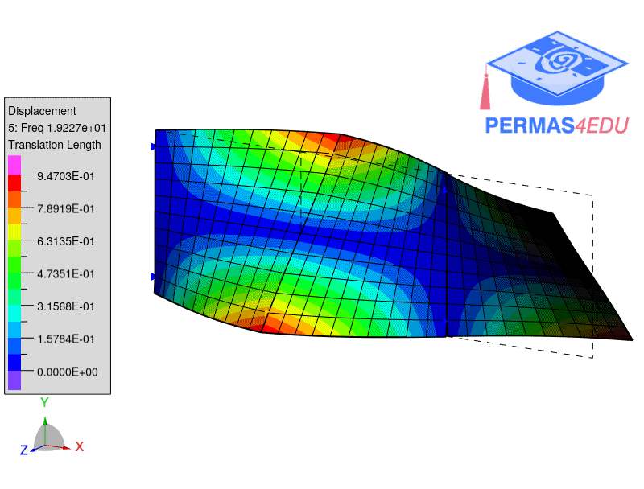
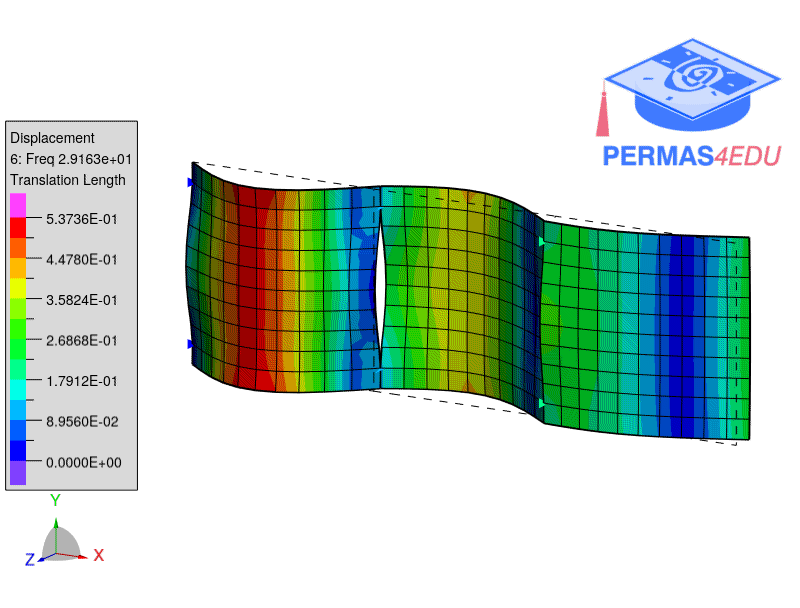

***
[⬅️](../115/README.md "Previous example")
[➡️](../README.md "Go up one directory level")
***
The example is adapted from [Theoretical modeling, assembly optimization, and vibration analysis of multi-plate structures](https://doi.org/10.1016/j.ijmecsci.2026.111815)

Thanks to Yifeng Li for private communication.

