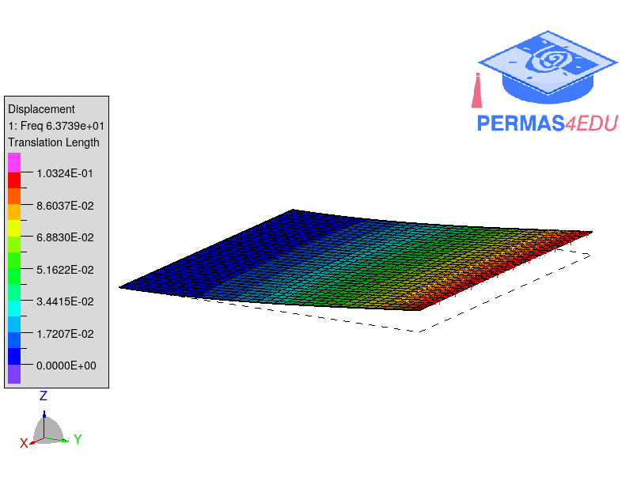
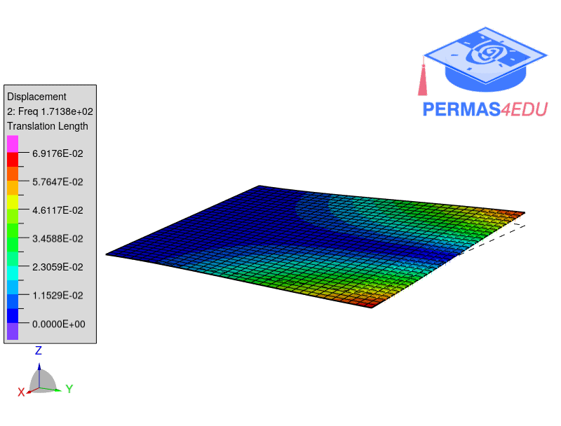
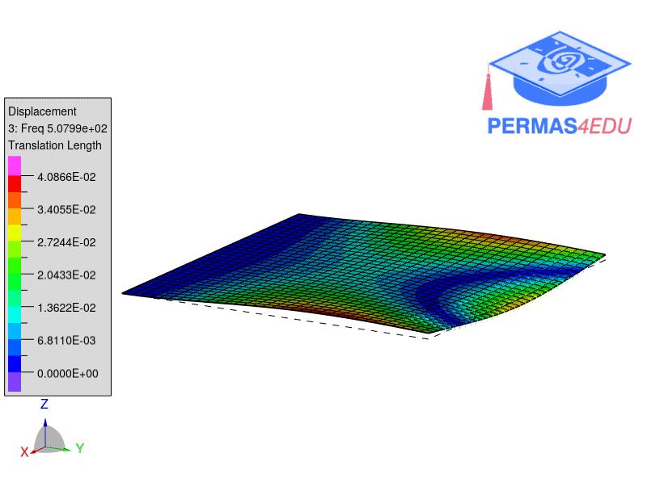

***
[⬅️](../117/README.md "Previous example")
[➡️](../119/README.md "Next example")
***
The example is adapted from [Full-field full-stress-tensor identification of base-excited structures](https://doi.org/10.1016/j.ymssp.2026.114786)

Thanks to  Janko Slavič, Jaša Šonc and Klemen Zaletelj for private communication and sharing data.
Their support is greatly appreciated.

