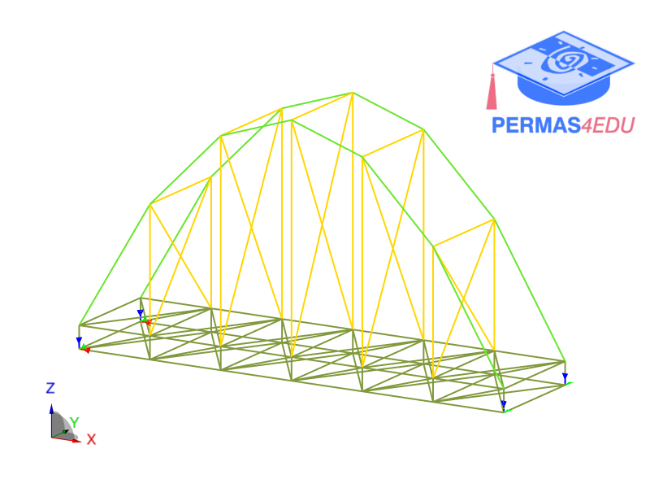

***
[⬅️](../119/README.md "Previous example")
[➡️](../121/README.md "Next example")
***

The examples are adapted from [Decomposition-Free Variational Quantum Eigensolvers for Natural Frequency Analysis in Structural Engineering](https://doi.org/10.1002/nme.70412)

