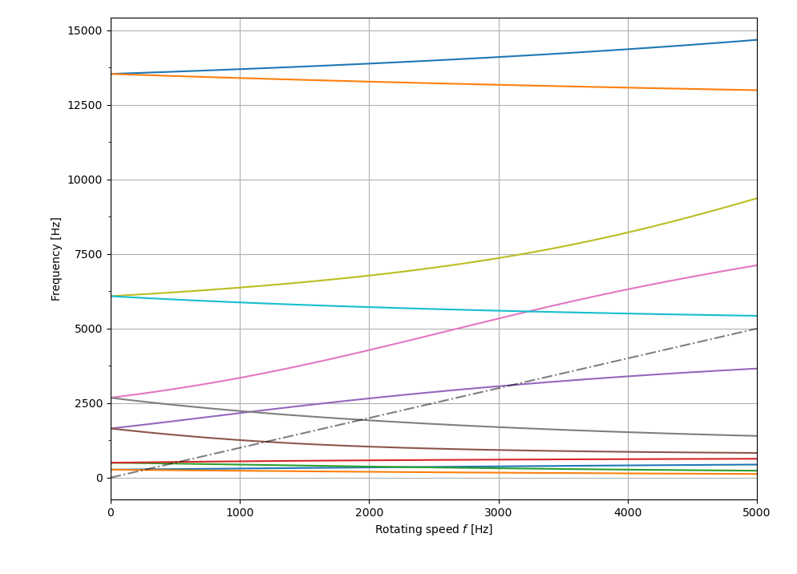

***
[⬅️](../README.md "Go up one directory level")
[➡️](../002/README.md "Next example")
***

The example is taken from [Eigensensitivity of damped system with distinct and repeated eigenvalues by chain rule](https://doi.org/10.1002/nme.7331)

