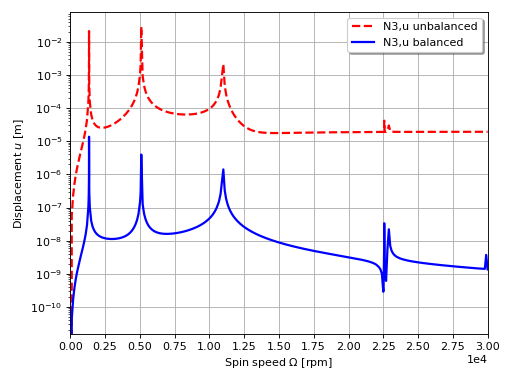

***
[⬅️](../0004/README.md "Previous example")
[➡️](../0006/README.md "Next example")
***

The example is adapted from the paper about [Balancing of a linear elastic rotor-bearing system with arbitrarily distributed unbalance using the numerical assembly technique](https://doi.org/10.24425/bpasts.2021.138237)

