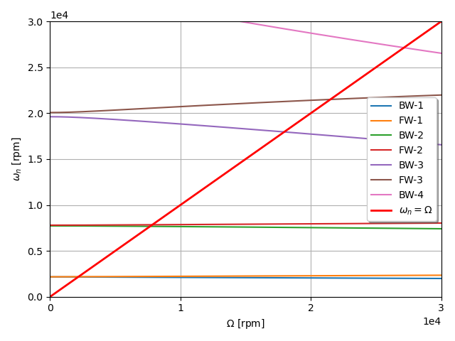

The example is adapted from [Reduced-Order Modeling in Rotordynamics and Its Robustness to Random Matrix Perturbation](https://doi.org/10.1115/1.4065038)

As the example uses some new features, version 20 of PERMAS is required. Stay tuned.

