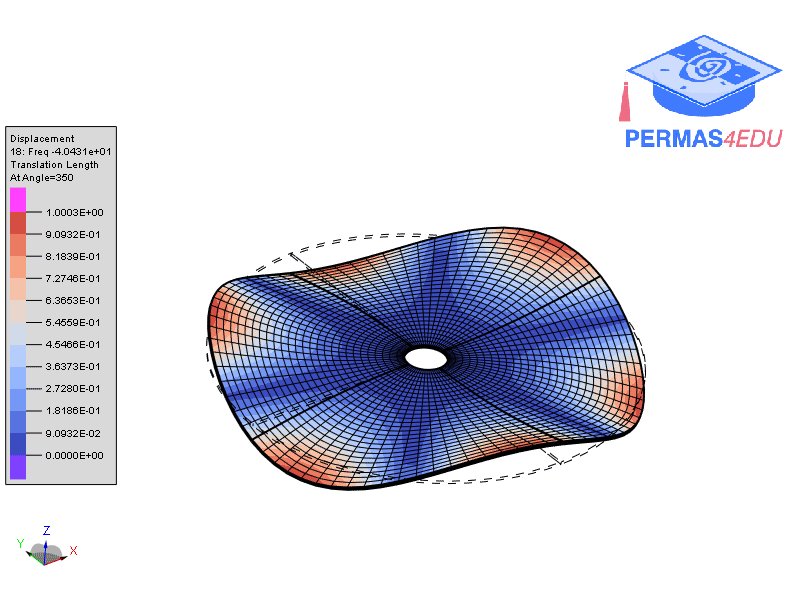

***
[⬅️](../0010/README.md "Previous example")
[➡️](../0012/README.md "Next example")
***

The example is adapted from [Vibration Reduction on Circular Disks with Vibroacoustic Metamaterials](https://doi.org/10.3390/app14114637)

