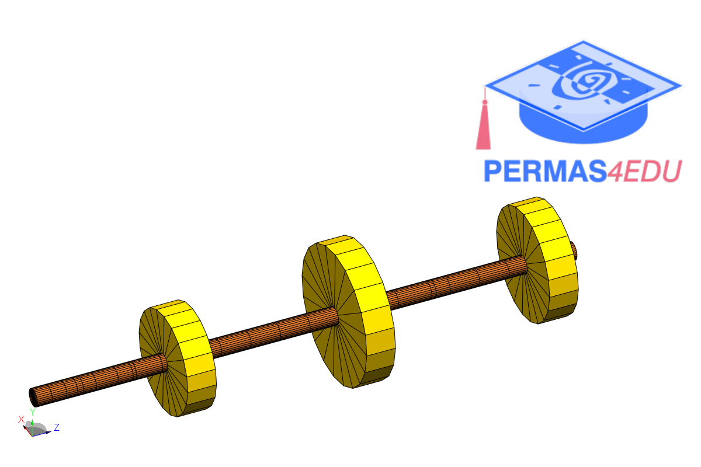
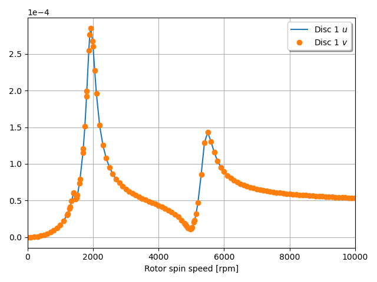

***
[⬅️](../0017/README.md "Previous example")
[➡️](../0019/README.md "Next example")
***

The example is adapted from [Efficient metamodeling and uncertainty propagation for rotor systems by sparse polynomial chaos expansion](https://doi.org/10.1016/j.probengmech.2024.103723)

Thanks to Ben-Sheng Xu for private communication. 

