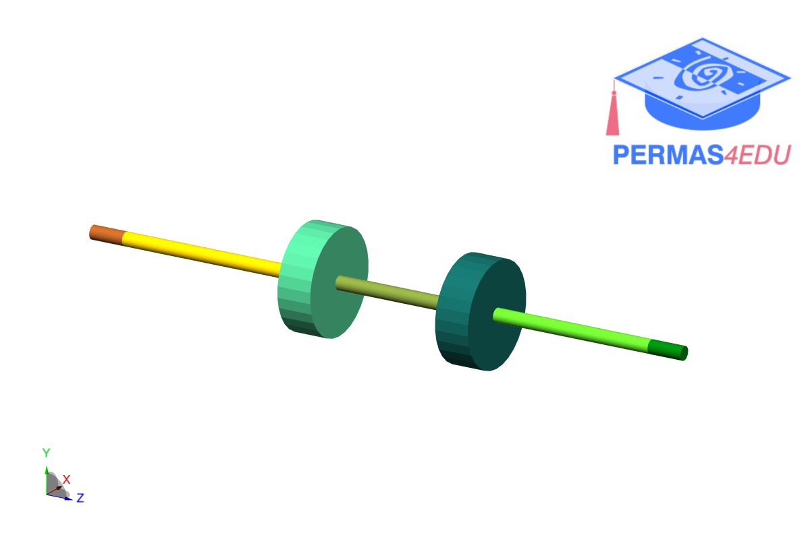

***
[⬅️](../0018/README.md "Previous example")
[➡️](../0020/README.md "Next example")
***

The example is adapted from [Integrated Artificial Intelligent and Physics‑Based Models for Unbalance Estimation in Rotating Systems](https://doi.org/10.1007/s42417-024-01739-9)

