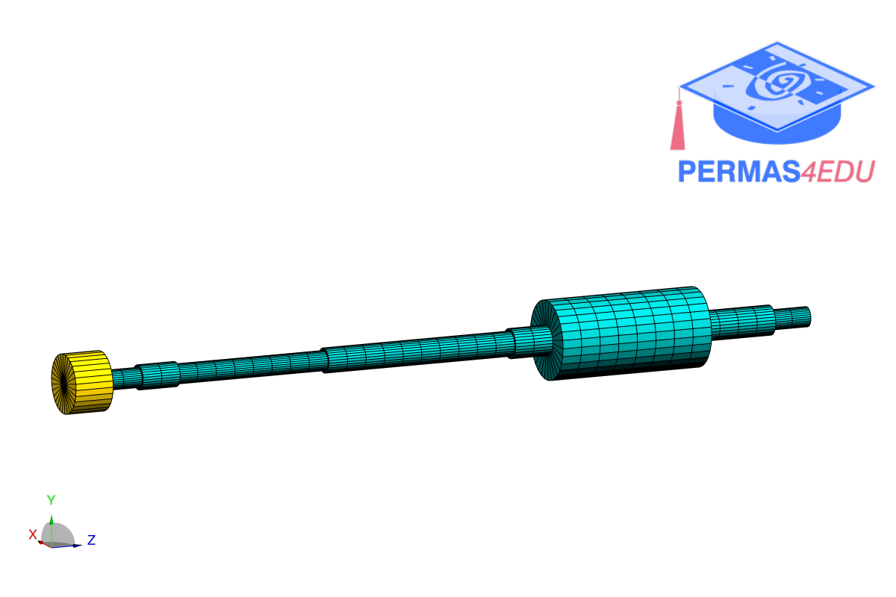

The example is adapted from [Nonlinear vibration analysis of rotor systems with hydrodynamic journal bearings using harmonic balance method](https://doi.org/10.1016/j.ijnonlinmec.2024.104992)

Thanks to Gil-Yong Lee for private communication. His support is greatly appreciated.

