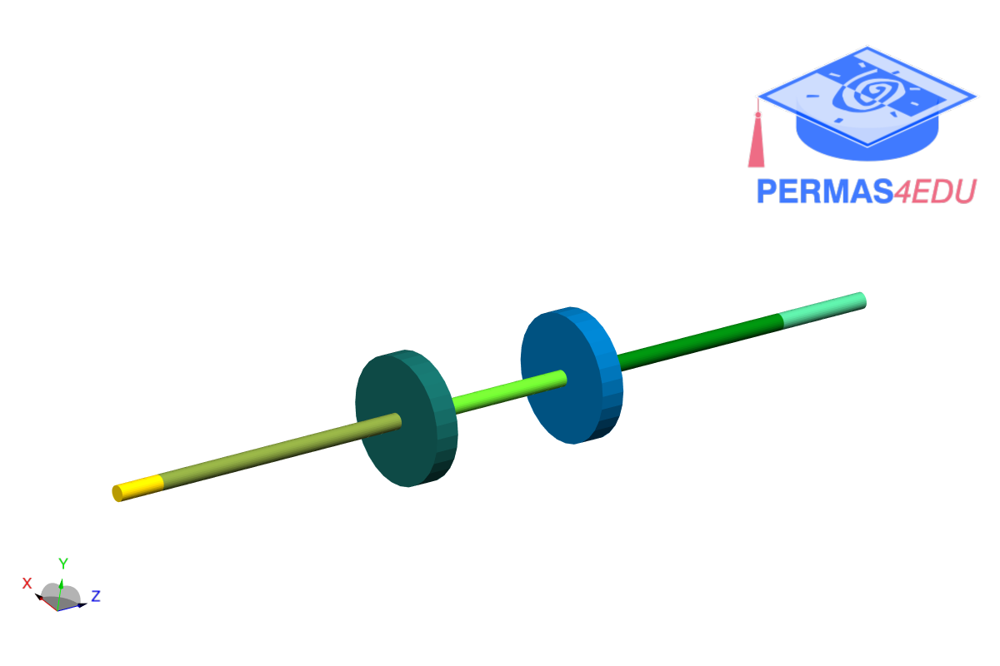

***
[⬅️](../0021/README.md "Previous example")
[➡️](../0024/README.md "Next example")
***

The example is adapted from [Identification of Unbalance in a Rotating System Using Artificial Neural Networks](https://doi.org/10.1007/978-3-031-49791-9_22)

