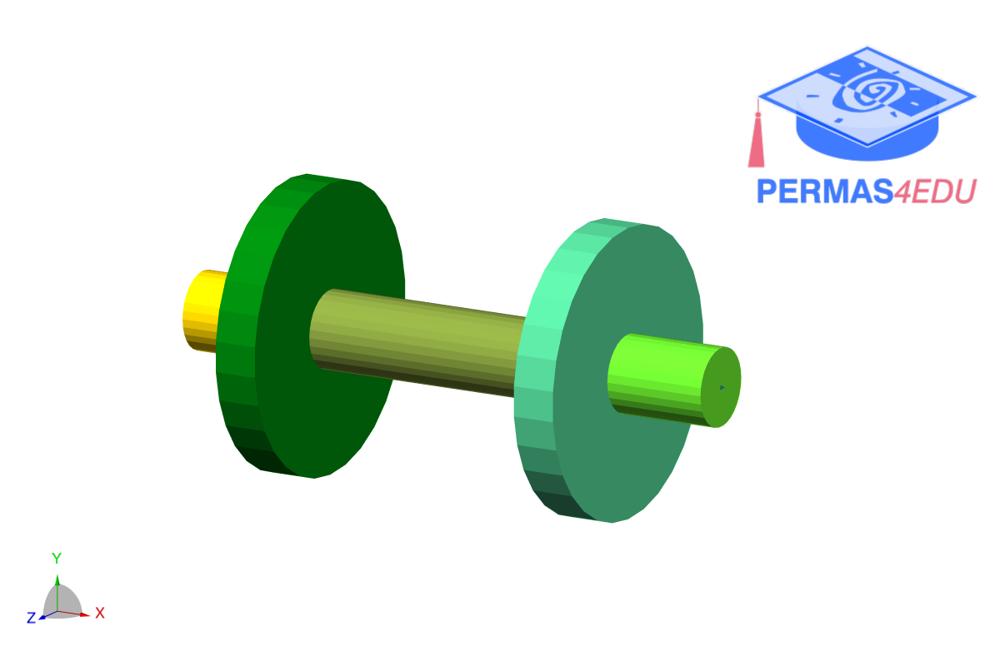

***
[⬅️](../0023/README.md "Previous example")
[➡️](../0025/README.md "Next example")
***

The example is adapted from [Modal analysis of multi-disk rotor system](http://dx.doi.org/10.3126/jiee.v7i1.66238)

