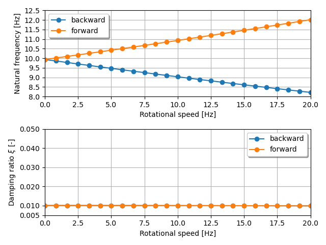
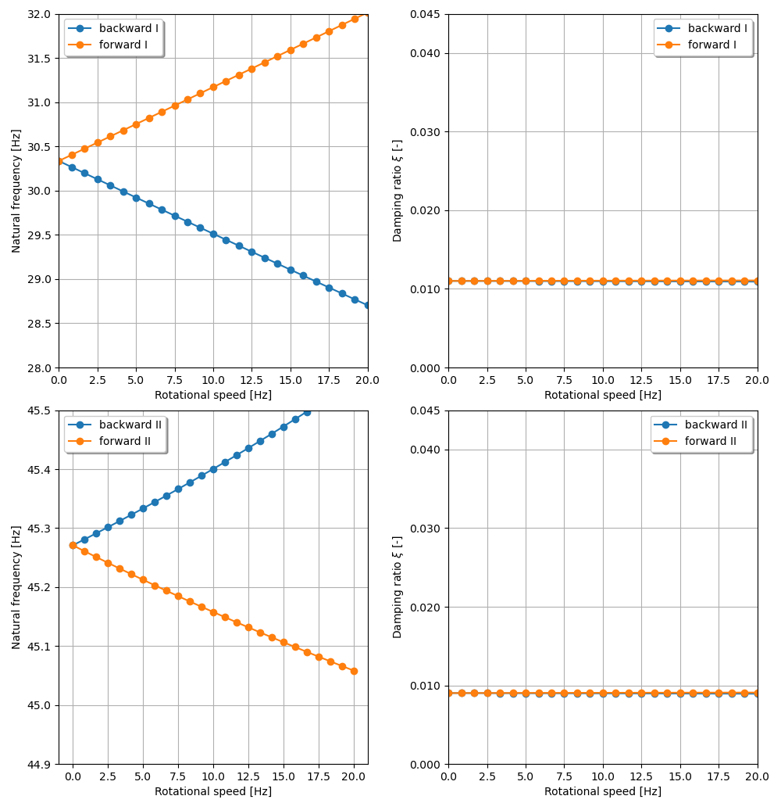

The examples are adapted from [Operational Modal Analysis Method for Separating Whirl Direction for Rotating Machinery](https://dx.doi.org/10.2139/ssrn.4753499)

### One-disk rotor model with gyroscopic effect

### Two-body model with rotor and casing

