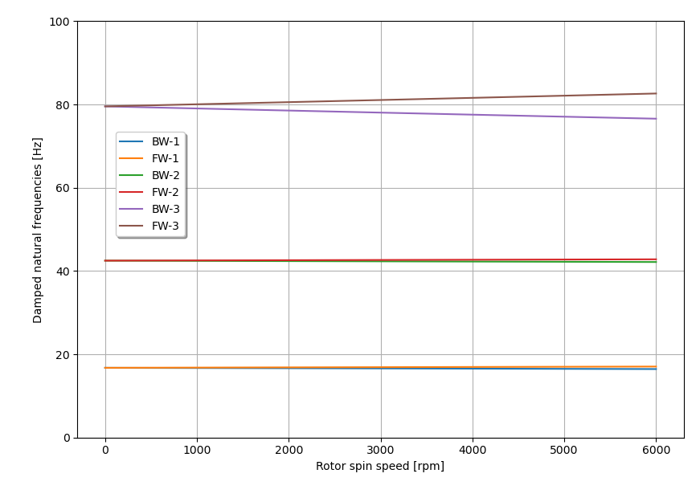

***
[⬅️](../0027/README.md "Previous example")
[➡️](../0029/README.md "Next example")
***

The example is adapted from [Internal Damping Instability of Rotors with Isotropic and Anisotropic Supports based on Complex Coordinates Formulation](https://doi.org/10.21205/deufmd.2025278012)

