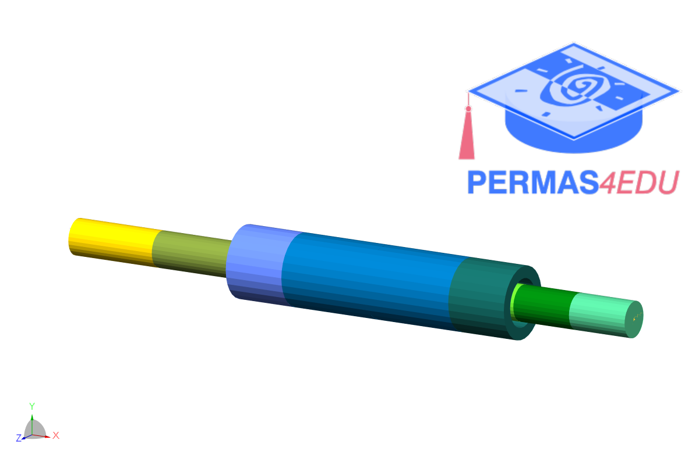
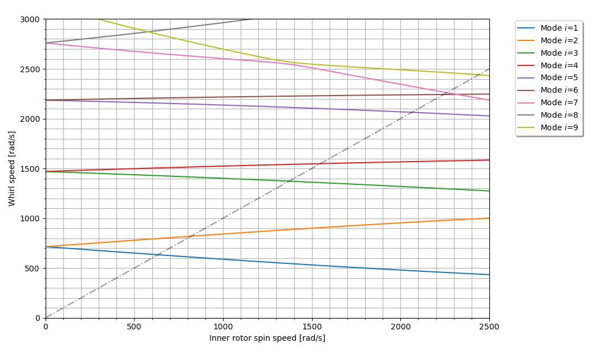

***
[⬅️](../0028/README.md "Previous example")
[➡️](../0030/README.md "Next example")
***

The example is adapted from [Transient and Steady State Analysis of a Flexible Coaxial-Rotor System Considering the Effect of Internal Damping on System Stability](https://doi.org/10.1007/s13369-024-09871-0)

Thanks to Dr. Shashank S. Singh for private communication.

