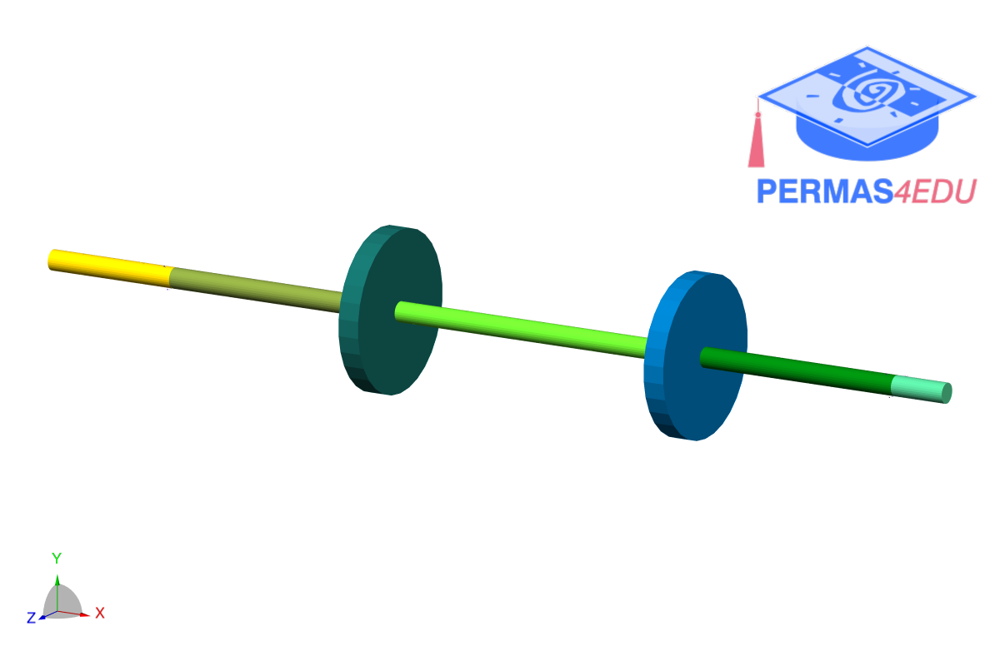

***
[⬅️](../0034/README.md "Previous example")
[➡️](../0036/README.md "Next example")
***

The example is adapted from [Balancing of rotating machines based on the Kriging surrogate approach](https://doi.org/10.1177/09544062251352620)

