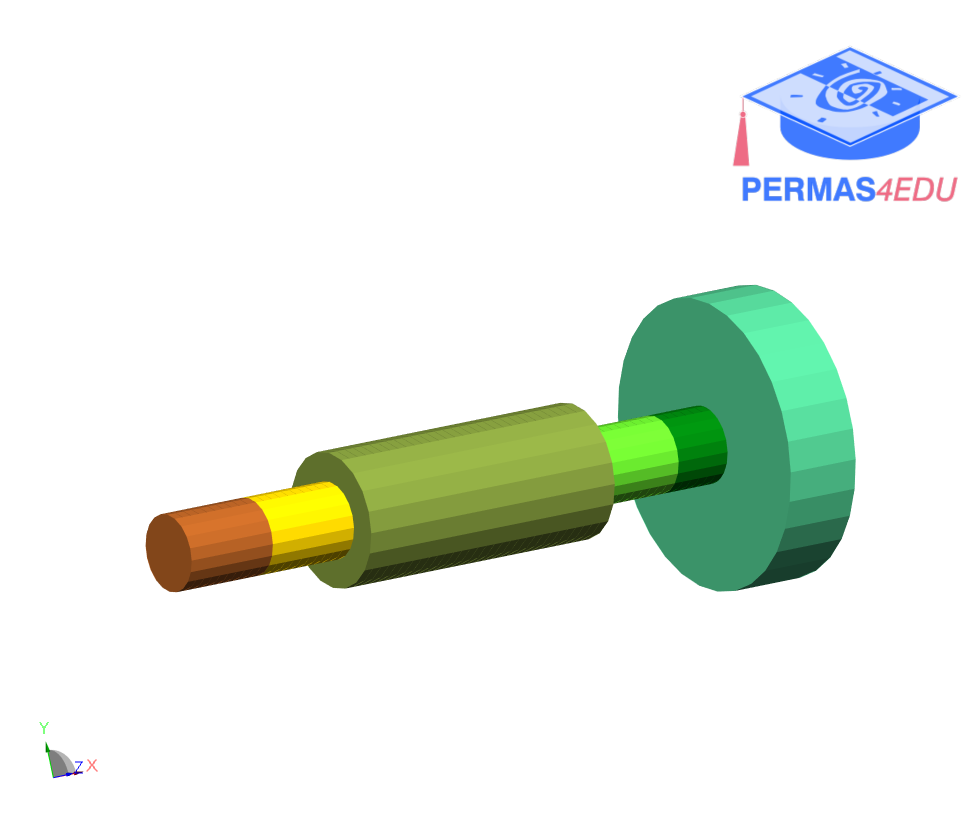

***
[⬅️](../0038/README.md "Previous example")
[➡️](../README.md "Go up one directory level")
***

The example is adapted from [Interval uncertainty quantification and design optimization of rotor system based on Legendre polynomial chaos-Kriging hybrid surrogate model](https://doi.org/10.1016/j.apm.2025.116676)

