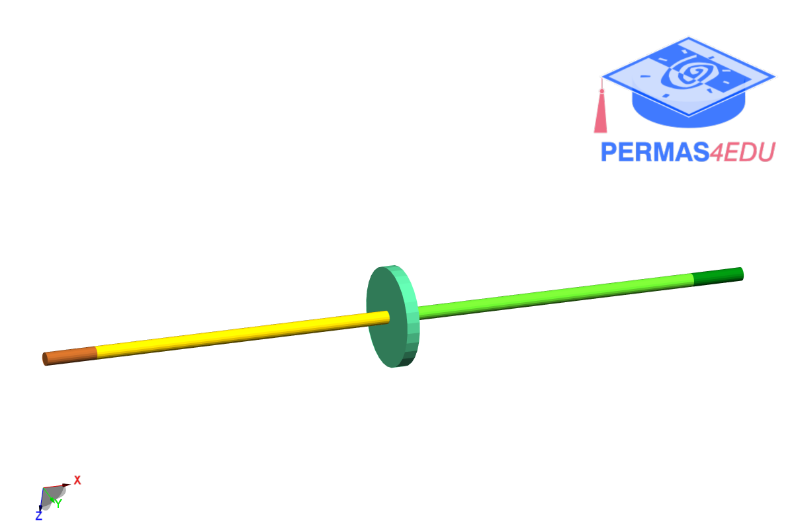

The example is adapted from [The influence of unbalance identification position on the transient dynamic balancing of a single-disk rotor without trial weights](https://doi.org/10.1177/10775463251407650)

