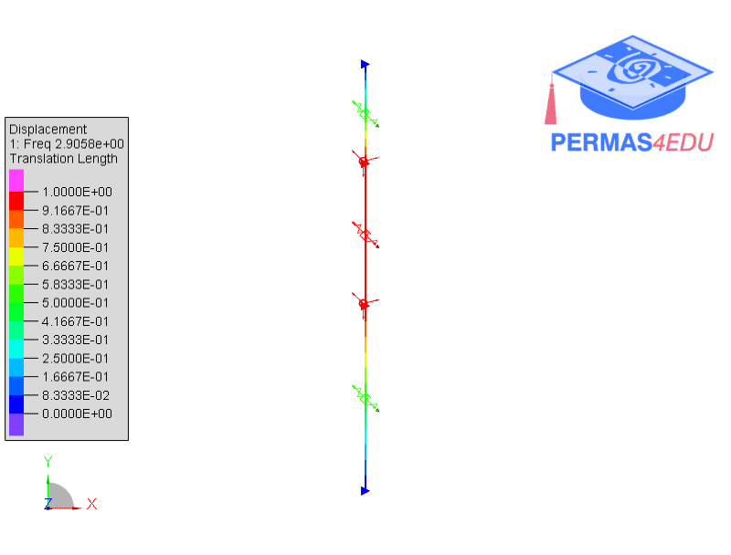
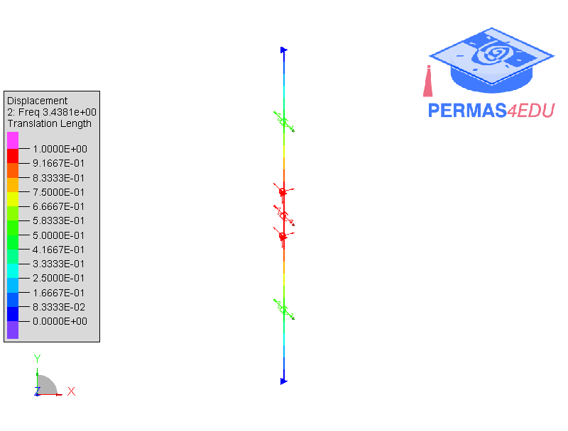
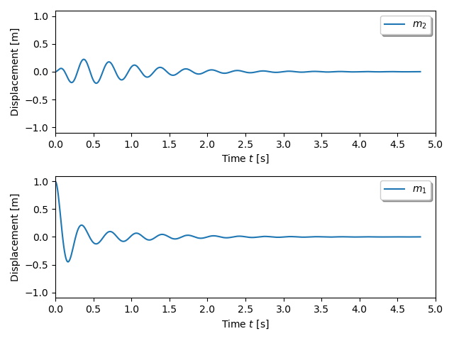

***
[⬅️](../0043/README.md "Previous example")
[➡️](../README.md "Go up one directory level")
***

The example is adapted from the book [Modalanalyse in der Strukturdynamik](https://doi.org/10.1007/978-3-658-49062-1)

