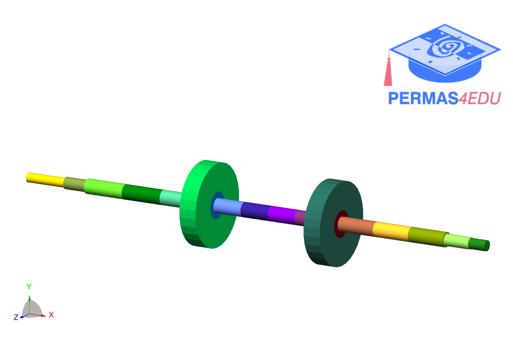
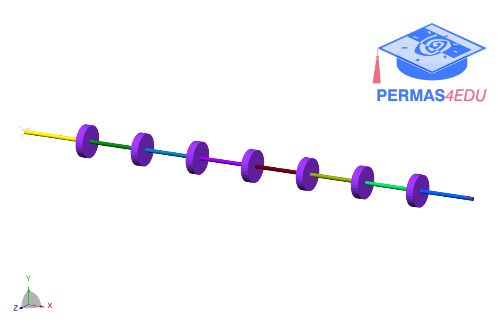

***
[⬅️](../0045/README.md "Previous example")
[➡️](../README.md "Go up one directory level")
***

The examples are adapted from [A formulation for rotor-foundation interaction via dynamic substructuring and virtual point transformation](https://doi.org/10.1016/j.ymssp.2026.113879)

