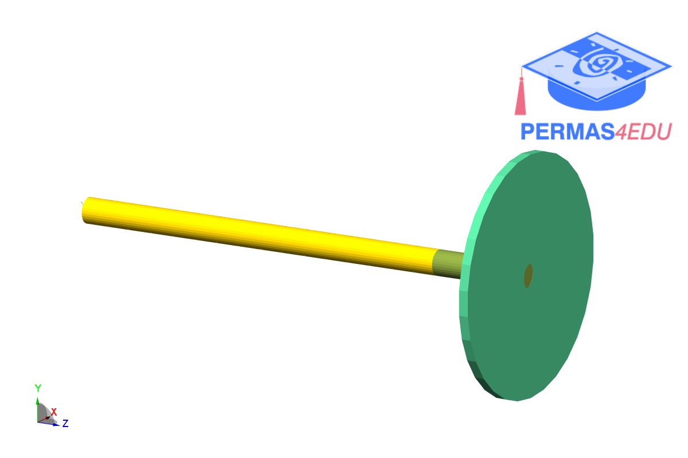

***
[⬅️](../0046/README.md "Previous example")
[➡️](../README.md "Go up one directory level")
***

The example is adapted from [A direct model updating method for damped gyroscopic systems with preserved physical connectivity](https://doi.org/10.1177/10775463261424862)

