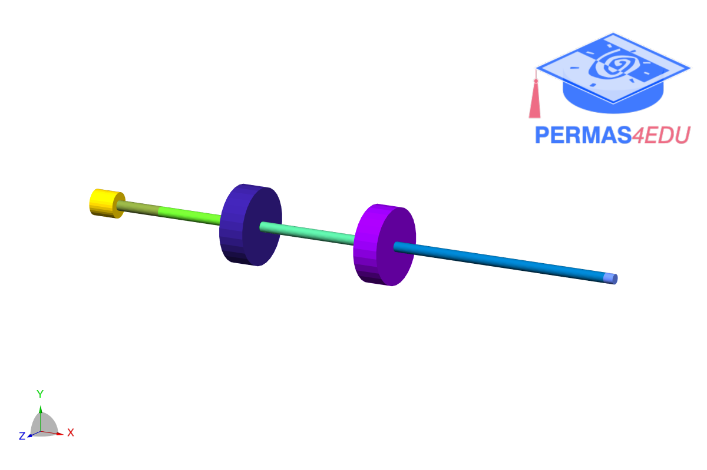
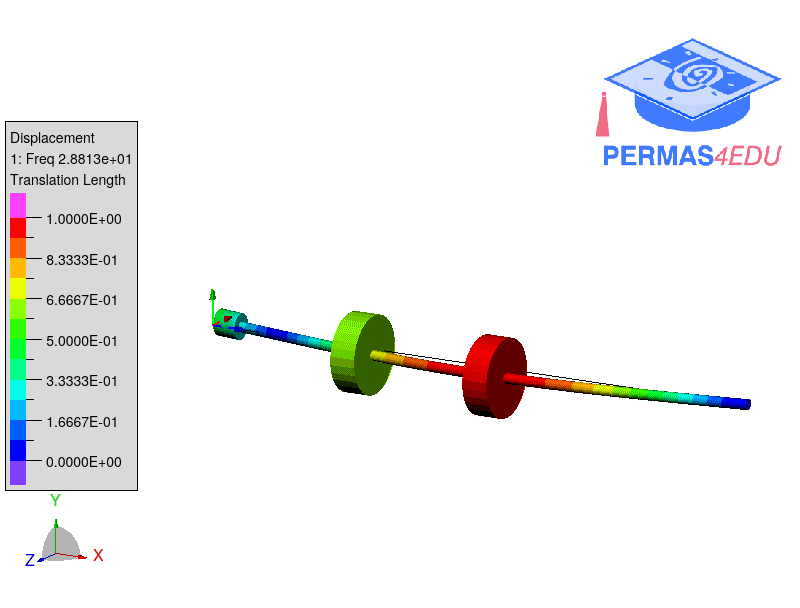

***
[⬅️](../0047/README.md "Previous example")
[➡️](../0049/EADME.md "Next example")
***
The example is adapted from [DYNAMIC ANALYSIS AND FORCED RESPONSE OF A ROTOR-BEARING SYSTEM USING THE FINITE ELEMENT METHOD](https://doi.org/10.31130/ud-jst.2025.23(10B).636E). Thanks to Dang Phuoc Vinh for private communication.

 

