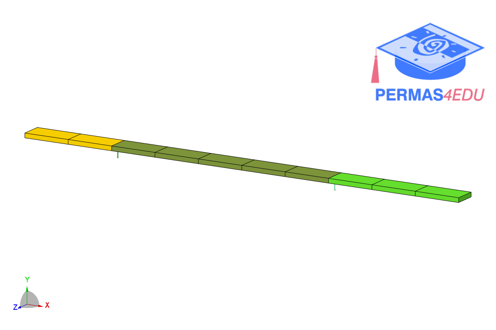

***
[⬅️](../0048/README.md "Previous example")
[➡️](../0050/README.md "Next example")
***
The examples are adapted from [Mitigating Window-Induced Distortions in Modal Identification of Non-Proportionally Damped Systems using Sensitivity-Based Model Updating](https://doi.org/10.1007/s42417-026-02368-0)

