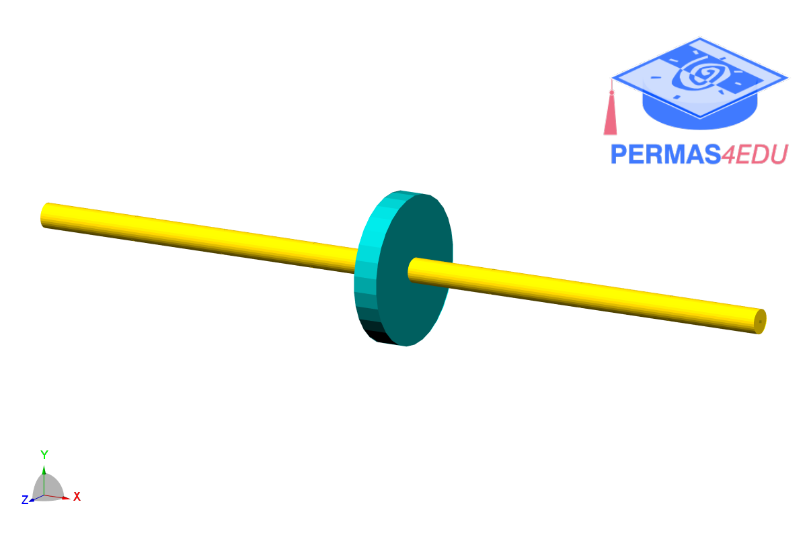
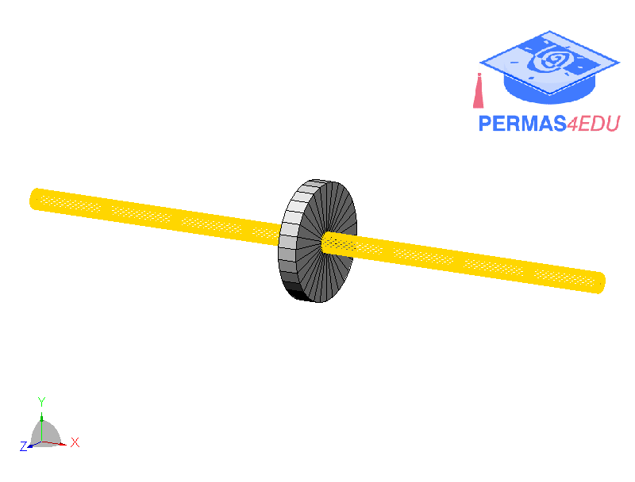

***
[⬅️](../0049/README.md "Previous example")
[➡️](../README.md "Go up one directory")
***

The example is adapted from [Transverse Vibration Characteristics of Aero-engine Casing-rotor System Based on Shaft-disc Hybrid Elements](https://doi.org/10.1007/s42417-026-02502-y)

