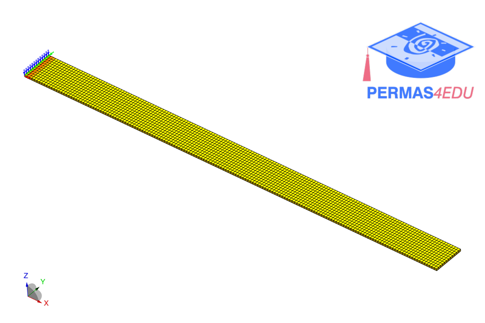

***
[⬅️](../0050/README.md "Previous example")
[➡️](../0052/README.md "Next example")
***

The examples are adapted from [Operational Modal Analysis of Structural Vibrations Using Total Least-Squares Dynamic Mode Decomposition](https://doi.org/10.2139/ssrn.6885482)

### 6-DOF system

### Steel cantilever beam

