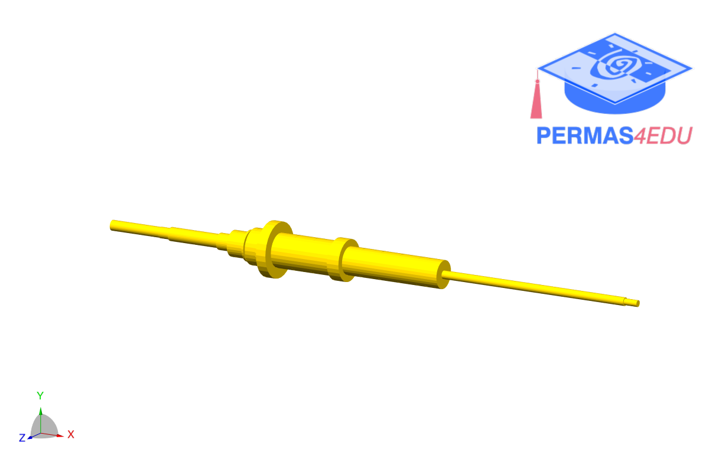

***
[⬅️](../0051/README.md "Previous example")
[➡️](../README.md "Go up one directory")
***

The example is adapted from [Transient Rotordynamic Modelling using Pseudo Spectral Method with Experimental Validatioon an Overhung Rotor](https://doi.org/10.1007/978-3-032-16528-2_29)

